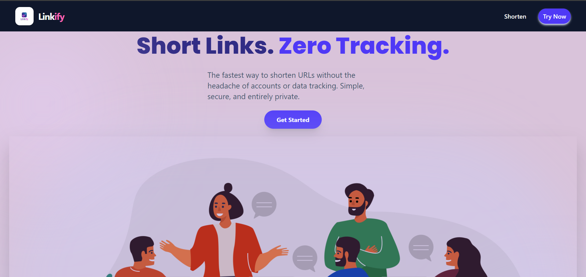

# Linkify - Short Links. Zero Tracking.

<p align="center">
  
</p>

**Linkify** is a modern, privacy-focused URL shortener built with **Next.js**. It provides the fastest way to shorten long URLs without the headache of accounts or intrusive data tracking. Simple, secure, and entirely private.

---

## Features

- **Instant Shortening:** Generate clean, short links in seconds.
- **Zero Tracking:** Privacy-first approach with no user data collection or tracking.
- **No Accounts Needed:** Start shortening immediately without any sign-up process.
- **Modern UI:** A clean, purple-themed aesthetic with a focus on simplicity and speed.
- **Fully Responsive:** Works perfectly across mobile, tablet, and desktop devices.
- **Built with Next.js:** Optimized performance and SEO-friendly.

---

## Tech Stack

- **Framework:** [Next.js](https://nextjs.org/)
- **Styling:** [Tailwind CSS](https://tailwindcss.com/)
- **Fonts:** [Geist](https://vercel.com/font) (Optimized via `next/font`)
- **Icons:** React Icons / Lucide React

---

## Getting Started

First, run the development server:

```bash
git clone [https://github.com/YakshJakharia06/URL-shortner.git](https://github.com/YakshJakharia06/URL-shortner.git)

npm run dev
# or
yarn dev
# or
pnpm dev
# or
bun dev
